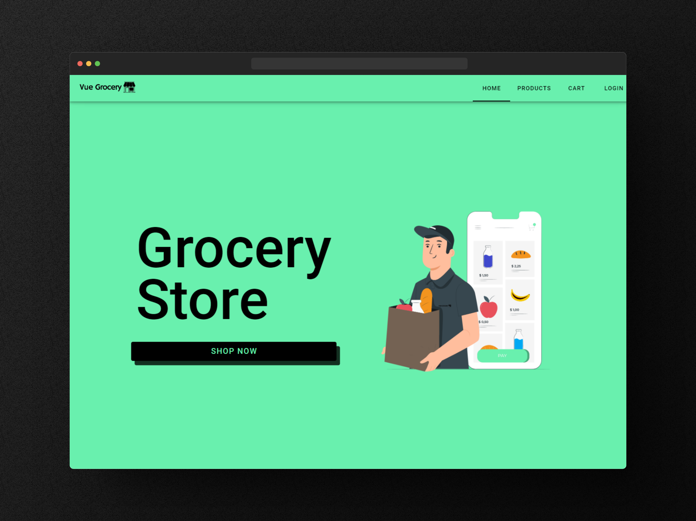

<h1 align="center"> EGrocery Store 🛒🛍️ </h1>



## 🟢 Introdução

A eGrocery Store é um site de supermercado online construído utilizando Vue 3.0, Vuetify e Pinia. Este projeto tem como objetivo fornecer uma aplicação web simples e amigável para compras de supermercado online. O site oferece uma ampla variedade de produtos de supermercado e permite que os clientes naveguem facilmente, adicionem itens ao carrinho e concluam a compra.


## 🔧 Funcionalidades

- Interface amigável para navegação e compras fáceis
- Adicione produtos ao carrinho e gerencie o conteúdo do carrinho
- Processo de checkout com resumo do pedido
- Design responsivo para uma experiência perfeita em vários dispositivos
- Adicione, remova e edite produtos da loja


## 📌 Como usar?

```bash
# Clone este repositório
$ git clone https://github.com/Eliezir/Vue-Grocery-Store

# Acesse o repositório do frontend
$ cd EGrocery-Store

# Instale as dependências do frontend
$ yarn install

# Execute o servidor de desenvolvimento do frontend
$ yarn dev

```

Depois de executar esses comandos, o frontend do eGrocery estará em execução. Você pode acessá-lo abrindo seu navegador da web e navegando até a porta exibida no terminal.


Para o backend em Laravel:
```bash
# Acesse o repositório do backend
$ cd cd EGrocery-Store/api

# Instale as dependências do backend
$ composer install

# Copie o arquivo `.env.example` para `.env` e configure-o com suas informações de banco de dados

# Gere a chave de aplicativo do Laravel
$ php artisan key:generate

# Execute as migrações do banco de dados
$ php artisan migrate

# Certifique-se de que o servidor XMPP esteja em execução para comunicação em tempo real

# Execute as seeders para popular o banco de dados
$ php artisan db:seed --class=ProdutosSeeder

# Execute o servidor de desenvolvimento do Laravel
$ php artisan serve

```

## Tecnologias Utilizadas

O projeto eGrocery Store utiliza as seguintes tecnologias:

- [Vue.js 3.0](https://vuejs.org) : Um framework JavaScript progressivo para construir interfaces de usuário.
- [Vuetify](https://vuetifyjs.com/en/): Um framework de componentes de Material Design Vue.js para criar componentes de UI elegantes e responsivos.
- [Pinia](https://pinia.vuejs.org) : Uma biblioteca de gerenciamento de estado para aplicações Vue.js.
- [Laravel](https://laravel.com) : Um framework PHP para desenvolvimento web elegante e expressivo.
- [XMPP](https://xmpp.org) : Um protocolo de mensagens instantâneas e presença baseado em XML.


<sub>Made with 💜 by <a href="https://github.com/Eliezir">Eliezir Neto</a> </sub>
